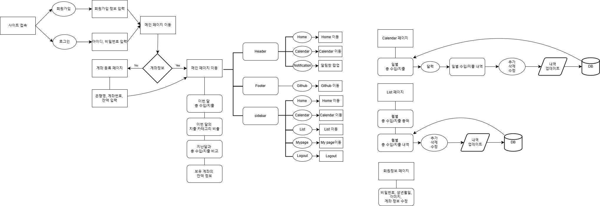
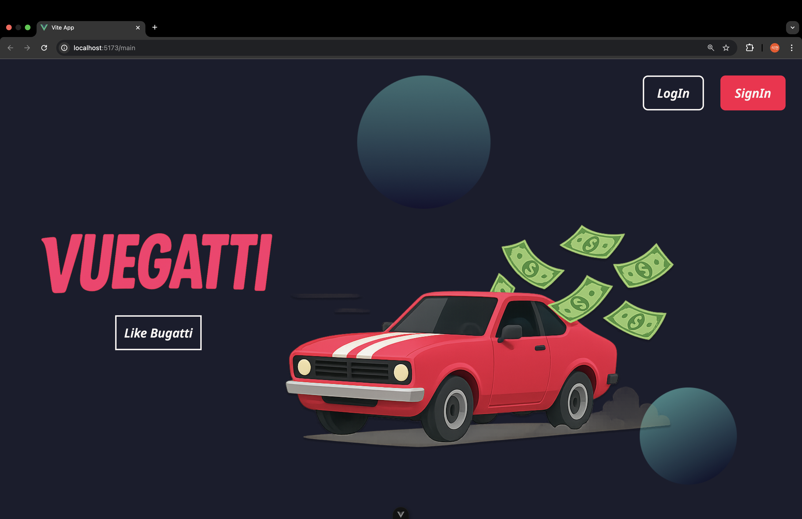
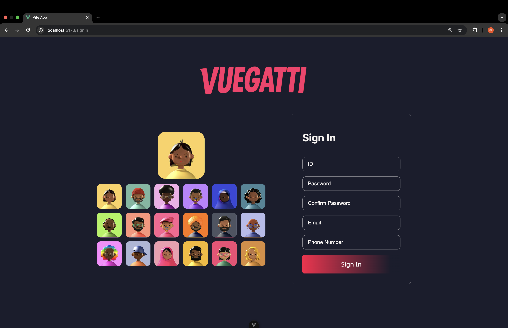
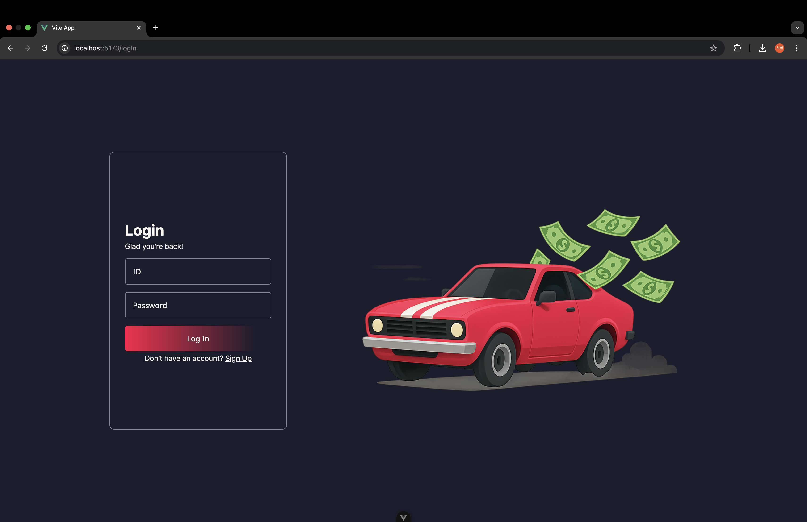
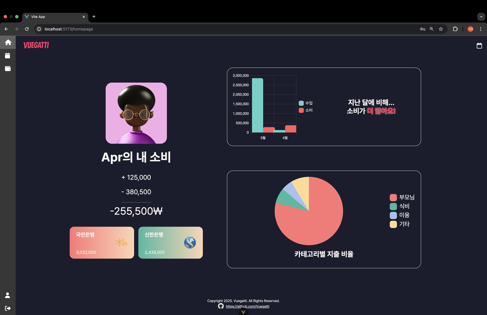
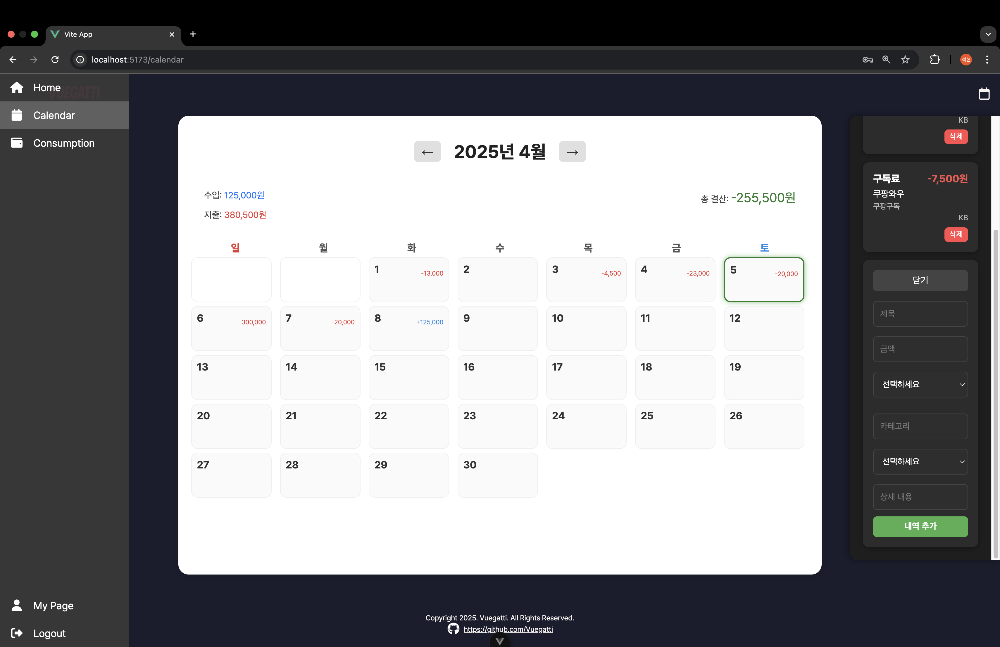
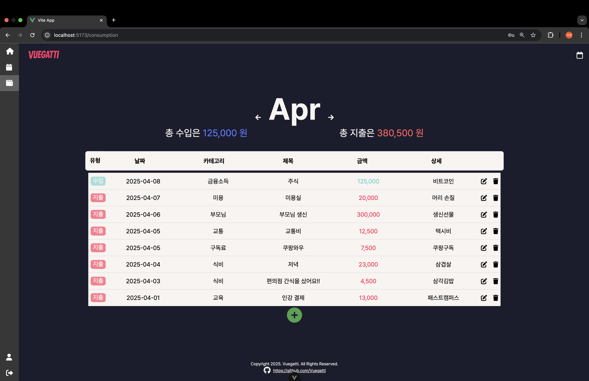
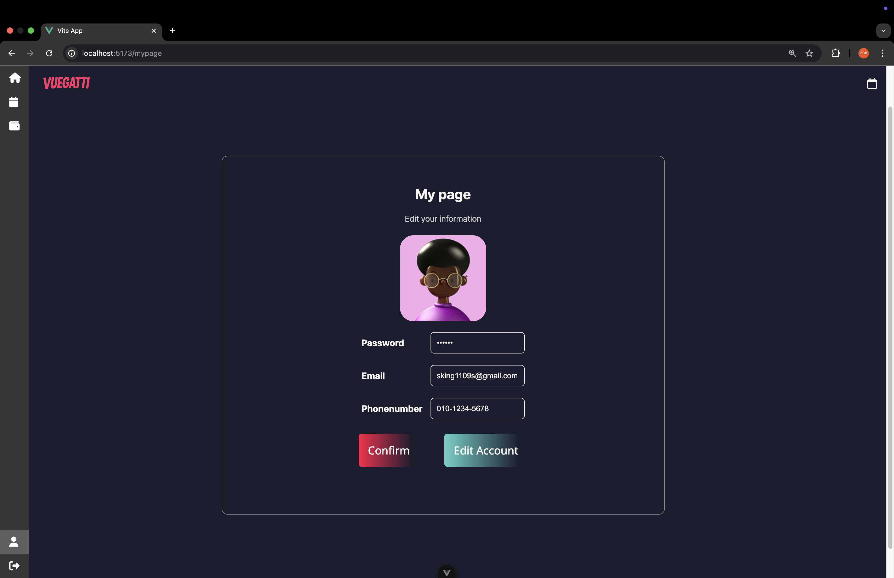
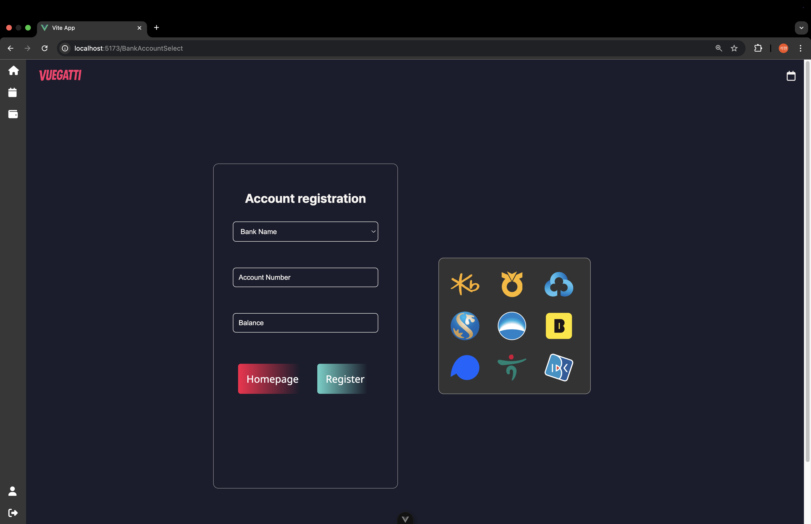

# 🏎️ 우린 Vue로 달린다. 뷰우우— 빠르고 우아하게.

> **"단순한 프레임워크 그 이상."**  
> **"우아한 곡선, 폭발적인 퍼포먼스 — 그게 바로 뷰가티(Vuegatti)."**

---

## Live Demo

[](https://vuegatti-front.vercel.app/main)

---

## GitHub Repository

[](https://github.com/Vuegatti/VuegattiFront)

---

## Flow Chart

<details open>
  <summary>Click to view</summary>
  
</details>

---

## Wireframes

<details open>
  <summary>Click to view</summary>

<table>
  <tr>
    <td></td>
    <td></td>
    <td></td>
  </tr>
  <tr>
    <td></td>
    <td></td>
    <td></td>
  </tr>
  <tr>
    <td></td>
    <td></td>
    <td></td>
  </tr>
</table>

</details>

---

## 주요 기능

- 캘린더 기반 수입/지출 기록
- 카테고리별 소비 통계 시각화
- 날짜별 메모 기능
- 로그인 및 마이페이지 관리

---

## Contributors

<table>
  <tr>
    <td align="center">
      <a href="https://github.com/Ahnsaeyeon">
        
        <br /><sub><b>@Ahnsaeyeon</b></sub>
      </a>
    </td>
    <td align="center">
      <a href="https://github.com/kxxheehxxn">
        
        <br /><sub><b>@kxxheehxxn</b></sub>
      </a>
    </td>
    <td align="center">
      <a href="https://github.com/bikdh1109">
        
        <br /><sub><b>@bikdh1109</b></sub>
      </a>
    </td>
    <td align="center">
      <a href="https://github.com/Kyuyueonyy">
        
        <br /><sub><b>@Kyuyueonyy</b></sub>
      </a>
    </td>
    <td align="center">
      <a href="https://github.com/chaeging">
        
        <br /><sub><b>@chaeging</b></sub>
      </a>
    </td>
  </tr>

</table>

---

## 프로젝트 실행 방법

```bash
git clone https://github.com/Vuegatti/VuegattiFront.git
cd VuegattiFront
npm install
npm run dev
```
